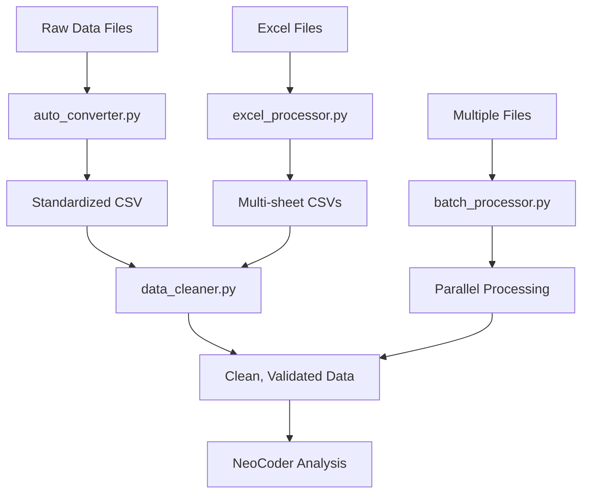

# NeoCoder Data Processing Scripts

This directory contains automated data processing scripts for the NeoCoder Data Analysis incarnation.

## 📁 Directory Structure

```
data/
├── downloads/          # Place raw data files here
├── scripts/           # Automated processing scripts (this directory)
│   ├── auto_converter.py      # Format detection and conversion
│   ├── data_cleaner.py        # Data cleaning and validation
│   ├── batch_processor.py     # Batch processing multiple files
│   ├── excel_processor.py     # Specialized Excel processing
│   ├── refresh_guidance_hub.py # Utility to refresh guidance hub
│   └── README.md             # This file
└── processed/         # Output directory for processed files
```

## 🚀 Quick Start

### 1. Batch Process All Files
```bash
# Process all files in the downloads directory
python batch_processor.py

# Or specify custom directories
python batch_processor.py --input-dir /path/to/data --output-dir /path/to/output
```

### 2. Convert Individual Files
```bash
# Auto-detect format and convert
python auto_converter.py data.json

# Process specific Excel file
python excel_processor.py spreadsheet.xlsx
```

### 3. Clean Data
```bash
# Clean and standardize data
python data_cleaner.py input.csv -o output_cleaned.csv
```

## 📋 Script Details

### `auto_converter.py` - Universal File Converter

**Purpose:** Automatically detects file formats and converts them to CSV for analysis.

**Supported Formats:**
- CSV (validation and standardization)
- JSON and JSON Lines
- Excel (.xlsx, .xls) - all sheets
- TSV (Tab-separated values)
- Text files with delimited data

**Usage:**
```bash
# Convert single file
python auto_converter.py data.json

# Process directory
python auto_converter.py /path/to/directory

# Generate detailed report
python auto_converter.py --report
```

**Features:**
- Automatic encoding detection
- Delimiter detection for text files
- Multi-sheet Excel support
- Processing reports and summaries
- Error handling and recovery

---

### `data_cleaner.py` - Data Quality Pipeline

**Purpose:** Comprehensive data cleaning and validation with quality scoring.

**Cleaning Operations:**
- Missing value handling and imputation
- Data type standardization
- Column name standardization (snake_case)
- Duplicate removal
- Outlier detection (IQR and Z-score methods)
- Data quality scoring (0-100 scale)

**Usage:**
```bash
# Basic cleaning
python data_cleaner.py input.csv

# Custom output and options
python data_cleaner.py input.csv -o cleaned.csv --missing-threshold 0.3

# Advanced options
python data_cleaner.py input.csv --outlier-method zscore --no-duplicates
```

**Output:**
- Cleaned CSV file
- Detailed cleaning report
- Data quality assessment
- Processing statistics

---

### `batch_processor.py` - Parallel Processing Pipeline

**Purpose:** Process multiple files simultaneously with parallel workers.

**Features:**
- Parallel processing (configurable workers)
- Automatic format detection
- Two-stage pipeline: conversion → cleaning
- Progress tracking and reporting
- Error handling and recovery
- Processing manifest generation

**Usage:**
```bash
# Process with default settings
python batch_processor.py

# Custom configuration
python batch_processor.py --input-dir /data --output-dir /processed --max-workers 8

# Quiet mode
python batch_processor.py --quiet
```

**Output:**
- Processed CSV files
- Processing manifest (JSON)
- Comprehensive batch report
- Individual file status tracking

---

### `excel_processor.py` - Advanced Excel Analysis

**Purpose:** Specialized Excel file processing with metadata extraction.

**Features:**
- Multi-sheet extraction and analysis
- Workbook metadata extraction
- Cell formatting detection
- Formula and chart detection
- Data type analysis per sheet
- Smart column naming

**Usage:**
```bash
# Process Excel file
python excel_processor.py spreadsheet.xlsx

# Custom output directory
python excel_processor.py data.xlsx -o /output/directory

# Save detailed JSON results
python excel_processor.py file.xlsx --save-results
```

**Output:**
- CSV file per sheet
- Excel processing report
- Metadata and analysis results
- Data quality assessment per sheet

---

### `refresh_guidance_hub.py` - System Utility

**Purpose:** Refresh the NeoCoder data analysis guidance hub content.

**Usage:**
```bash
# Refresh guidance hub
python refresh_guidance_hub.py
```

**When to Use:**
- After updating incarnation content
- When guidance hub shows outdated information
- After system restart or updates

## 🔧 Configuration Options

### Environment Variables
- `NEOCODER_DATA_DIR` - Override default data directory
- `NEOCODER_LOG_LEVEL` - Set logging level (INFO, DEBUG, WARNING)

### Common Parameters
- `--input-dir` - Input directory path
- `--output-dir` - Output directory path
- `--max-workers` - Parallel processing threads
- `--quiet` - Reduce output verbosity
- `--help` - Show detailed help for each script

## 📊 Processing Workflow



## 🎯 Best Practices

### File Organization
1. **Raw Data** → Place in `data/downloads/`
2. **Processing** → Scripts handle automatically
3. **Analysis** → Use processed files from `data/processed/`

### Processing Pipeline
1. **Batch Process** → Use `batch_processor.py` for multiple files
2. **Individual Files** → Use specific processors for custom needs
3. **Quality Check** → Review processing reports before analysis
4. **Load Data** → Use NeoCoder `load_dataset()` with processed files

### Error Handling
- Check processing reports for failed files
- Review error messages in log files
- Re-run individual processors for problematic files
- Use `--help` for detailed usage information

## 🚨 Troubleshooting

### Common Issues

**"Required libraries not available"**
```bash
# Install missing dependencies
pip install pandas openpyxl xlrd
```

**"Permission denied"**
```bash
# Check file permissions
chmod +x *.py
```

**"File encoding issues"**
- Scripts auto-detect encoding
- Check source file format
- Try manual conversion first

**"Processing timeout"**
- Increase timeout for large files
- Use batch processing for multiple files
- Check system resources

### Log Files
- `data_conversion.log` - Format conversion logs
- `data_cleaning.log` - Data cleaning operations
- `batch_processing.log` - Batch processing status
- `excel_processing.log` - Excel-specific processing

## 📈 Performance Tips

1. **Large Files** → Use batch processing with multiple workers
2. **Excel Files** → Use dedicated excel_processor.py for complex spreadsheets
3. **Memory Issues** → Process files individually rather than in batch
4. **Speed** → Use SSD storage for temporary files

## 🔗 Integration with NeoCoder

After processing, files are ready for NeoCoder analysis:

```python
# Load processed dataset
load_dataset(
    file_path="/home/ty/Repositories/NeoCoder-neo4j-ai-workflow/data/processed/your_file.csv",
    dataset_name="analysis_name",
    source_type="csv"
)

# Start analysis
generate_insights(dataset_id="DATASET_ID")
explore_dataset(dataset_id="DATASET_ID")
```

## 📝 Contributing

To add new processing scripts:
1. Follow the existing naming convention
2. Include comprehensive error handling
3. Generate processing reports
4. Update this README
5. Add logging and progress tracking

---

*For questions or issues, check the NeoCoder documentation or processing logs.*
